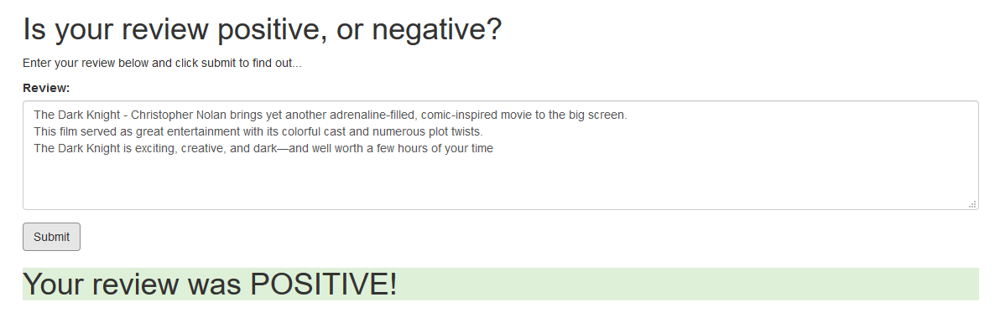
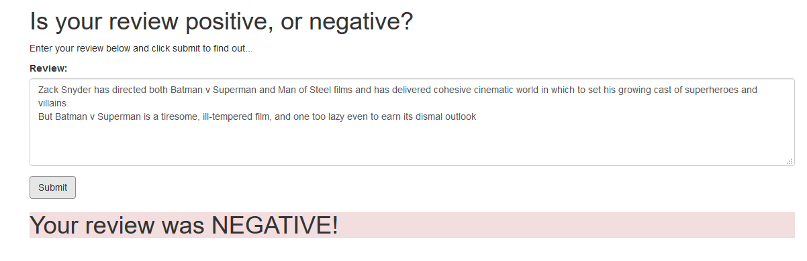

# Deep Learning - Sentiment Analysis - AWS SageMaker and PyTorch

This is custom LSTM model implemenataion for sentiment analysis of movie review. Developed LSTM model, trained, tested, deployed and served model through AWS SageMaker  

Below are some samples of sentiment analysis of movie review:  

1. Positive Review  
  

2. Negative Review  
  

There are 4 main parts of this model:  

1. **Pre-Processing**: Downloading IMDB movie review, cleaned up review text and constructed train and test preprocess data  

2. **LSTM**: Custom AWS SageMaker PyTorch LSTM model, trained, deployed model through AWS SageMaker  

3. **AWS Lambda**: Lambda Function calls AWS SageMaker endpoint and predict sentiment on moview review  

4. **AWS API Gateway**: REST API to serve user request. It invokes AWS Lambda with user review and get predicted response  

## Repository 

This repository contains:
* **SageMaker Project.ipynb** : Complete code for pre-processing, AWS SageMaker model training, testing and deployment. Also, source code and instruction for AWS Lambda and API Gateway  
* **train/model.py** : Custom PyTorch LSTM Model  
* **train/train.py** : Custom AWS SageMaker PyTorch training implementation  
* **serve/predict.py** : Custom AWS SageMaker PyTorch prediction implementation  
					  
## Datasets

Datasets necessary for this implementation can be downloaded by clicking  
[IMDB Review](http://ai.stanford.edu/~amaas/data/sentiment/aclImdb_v1.tar.gz) 

## List of Hyperparameters used:  

* Embedding Dimensions = **32**  
* Hidden Dimensions  = **100**   
* Number of Layers = **2**  

* Padding = **500**  
* Batch Size  = **512**   
* Epoch = **10**  
  
* Vocabulary Size = **5000**  
* Output Size = **1**  

* Loss Function = **BCELoss**  
* Optimizer  = **Adam**  
* Learning Rate = **0.001**  

